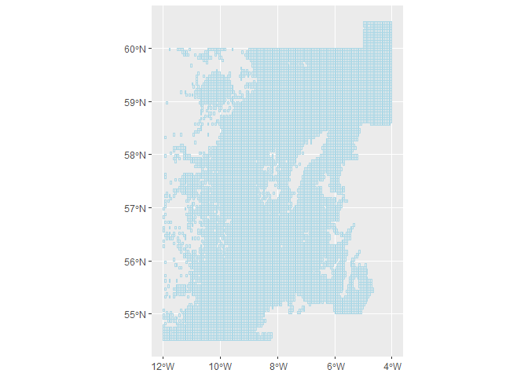

[](https://travis-ci.org/ices-tools-prod/icesVMS)
[](https://cran.r-project.org/package=icesVMS)
[](https://cran.r-project.org/package=icesVMS)
[](https://cran.r-project.org/package=icesVMS)

[](http://ices.dk)

# icesVMS

icesVMS Functions to support the creation of ICES Fisheries Overviews,
….

icesVMS is implemented as an [R](https://www.r-project.org) package
<!-- and available on [CRAN](https://cran.r-project.org/package=icesVMS). -->
and available on GitHub

## Installation

icesVMS can be installed from GitHub using the `install_github` command
from the `remotes` package:

``` r
library(remotes)
install_github("ices-tools-prod/icesVMS")
```

## Usage

For a summary of the package:

``` r
library(icesVMS)
?icesVMS
```

## Examples

## Download c square information

All of the VMS data submitted to ICES is at the c square level (concise
spatial query and representation system, (Rees 2003)), and to aid in the
exploration of display of data summaries extracted from the ICES
VMS/Logbook database there is a service to extract information related
to a C square. For example, the following code returns a table of all
the c squares in the Celtic Seas ecoregion (see
<https://ices.dk/community/advisory-process/Pages/ICES-ecosystems-and-advisory-areas.aspx>):

``` r
## celtic <- get_csquare(ecoregion = "Celtic Seas")
## sr_32D5 <- get_csquare(stat_rec="32D5")
get_csquare(c_square = "7501:114:383:4")
```

    ##   csquare_area
    ## 1     19.08342
    ##                                                                       wkt
    ## 1 POLYGON ((-14.4 51.85,-14.4 51.9,-14.35 51.9,-14.35 51.85,-14.4 51.85))
    ##   id       c_square stat_rec ices_area   ecoregion    lat     lon
    ## 1  3 7501:114:383:4     32D5       7k2 Celtic Seas 51.875 -14.375

These can be plotted by parseing the WKT (Well Known Text,
<https://en.wikipedia.org/wiki/Well-known_text_representation_of_geometry>)
feild and then using `ggplot2`, for example, to convert and them plot:

``` r
ukwest <- get_csquare(ices_area = "6a")
ukwest <- sf::st_as_sf(ukwest, wkt = "wkt", crs = 4326)

ggplot2::ggplot() +
  ggplot2::geom_sf(data = ukwest, color = "lightblue", fill = "transparent")
```

<!-- -->

## Download bottom contact model parameters (BENTHIS)

To calculate swept area ratio by c\_square

# References

<div id="refs" class="references">

<div id="ref-reese03_csquares">

Rees, Tony. 2003. “C-Squares, a New Spatial Indexing System and Its
Applicability to the Description of Oceanographic Datasets.”
*Oceanography* 16 (1): 11–19. <https://doi.org/10.5670/oceanog.2003.52>.

</div>

</div>
